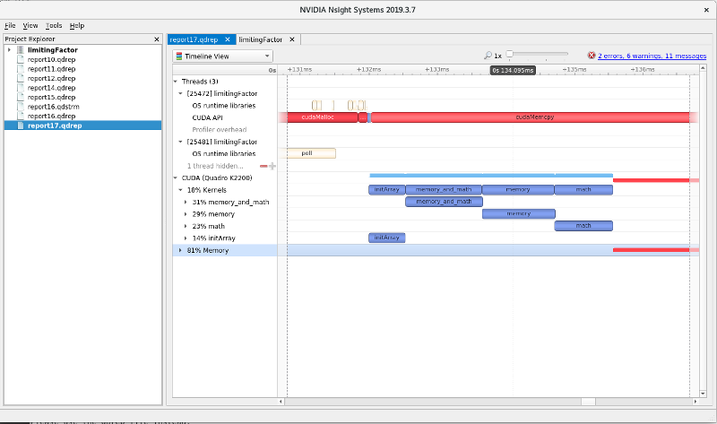
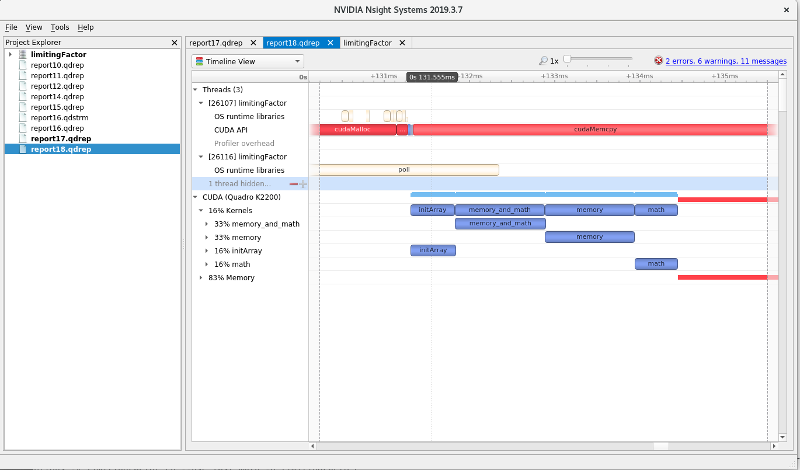

# Purpose:

- practice profiling tools
- understand what is the limiting factor of a CUDA application

The code is given in two equivalent version
- limitingFactor.cu in CUDA/C++
- limitingFactor.cuf in CUDA/Fortran (need the PGI compiler)

# Run and profile

## Build

Adapt the following to your CUDA hardware architecture 

### Config 1

```shell
nvcc -lineinfo -arch=sm_50 --ptxas-options -v limitingFactor.cu -o limitingFactor
```

### Config 2

```shell
nvcc -lineinfo -arch=sm_50 --ptxas-options -v limitingFactor.cu --use_fast_math -o limitingFactor
```

## Profile using command line

```shell
nsys profile ./limitingFactor
```

This will generate in your a file (e.g. _/home/pkestene/nvidia_nsight_systems/report17.qdrep_) with qdrep extension, containing profiling data.

## Visualize the profiling data

```shell
nsight-sys /home/pkestene/nvidia_nsight_systems/report17.qdrep
```

Repeat the previous step with config 2, and visualize again the profiling data.
What can you observe ?





# More information on NVIDIA profiling tools

Getting started:

- https://devblogs.nvidia.com/transitioning-nsight-systems-nvidia-visual-profiler-nvprof/

Additionnal slides:

- https://bluewaters.ncsa.illinois.edu/liferay-content/document-library/content/NVIDIA%20Nsight%20Systems%20Overview%20by%20Sneha%20Kottapalli.pdf
